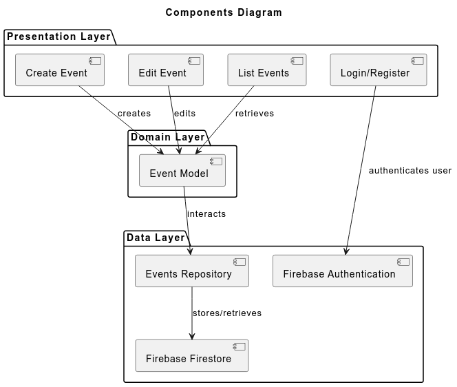
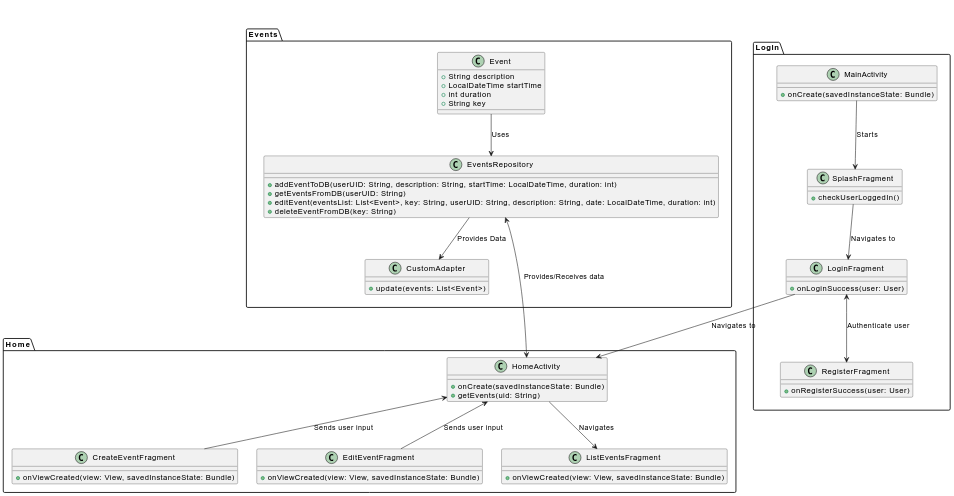
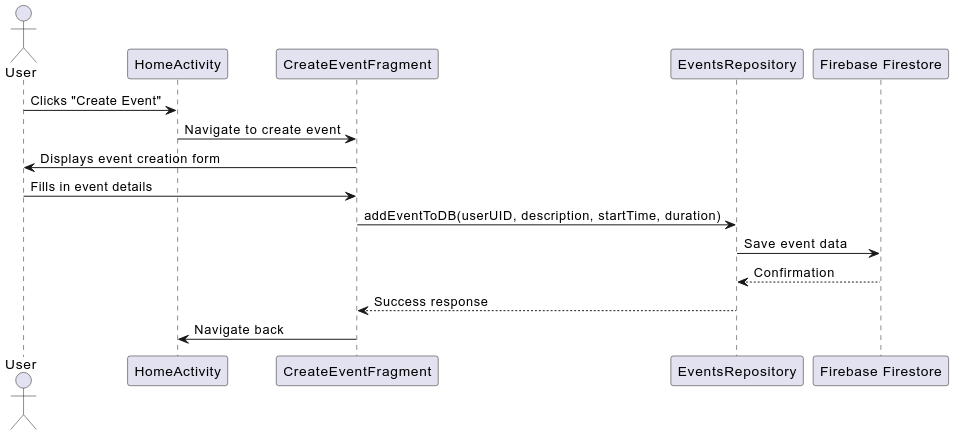
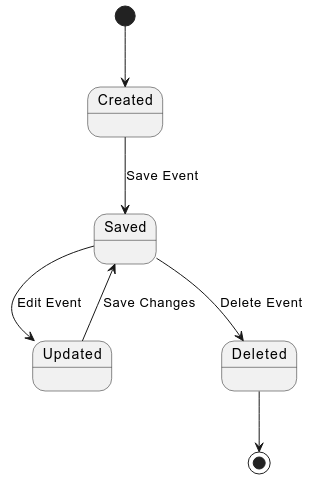

# Design

## Architecture

The app follows a **layered architecture**, which promotes a clear separation of concerns among its components. It enhances the maintainability, scalability, and testability of the app. The architecture consists of three main layers:

1. *Presentation layer*: It encompasses all UI components, including activities and fragments, which are responsible for displaying data to the user and capturing user inputs.

2. *Domain layer*: It consists of the application's business logic, represented by the data models. In this case, the `Event` class represents the core data structure, encapsulating all necessary information related to calendar events.

3. *Data layer*: This layer is responsible for data management and operations. It is represented by the `EventRespository` class, which interacts with Firebase for data storage and retrieval.

## Modelling
 
The **domain** on which Temporario is focused is time management, being a calendar app with the main functionalities relating to events, dates and scheduling. Its **bounded context** is the management of events (create, delete, edit).

The **domain model** of the calendar application is designed to encapsulate the core business logic and data associated with events, ensuring that the application can effectively manage, display, and manipulate calendar events. This model is built using principles from Domain-Driven Design (DDD), focusing on clarity, maintainability, and separation of concerns.

1. *Entities* - At the heart of the domain model is the `Event` entity. Each `Event` represents a specific calendar event and is characterized by the following attributes:
    - key - a unique identifier, which is essential for CRUD operations;
    - userUID - the ID of the user to whom the event belongs to;
    - description - a textual representation of the event's purpose or details;
    - startTime - the date and time when the event begins, allowing for precise scheduling;
    - duration - the length of the event, defined in hours, which aids in time management and conflict resolution.

    The `Event` entity is designed to have its own lifecycle, meaning it can be created, modified, and deleted as necessary.

2. *Repositories* - To manage data access and persistence, the `EventsRepository` serves as the intermediary between the domain model and the data storage layer (Firebase Firestore). This repository pattern provides the following benefits:
    - Abstraction: It abstracts the details of data storage and retrieval, allowing the rest of the application to interact with the repository without needing to know the specifics of Firebase Firestore.
    - Encapsulation: It encapsulates the logic for CRUD operations (Create, Read, Update, Delete) related to `Event` entities, ensuring that changes to data management strategies do not impact the higher layers of the application.
    - Consistency: The `EventsRepository` provides methods to add, edit, delete, and retrieve events from the database, ensuring that data operations are consistently handled.

3. *Data layer integration* - The model interacts with Firebase Firestore and Firebase Authentication to provide persistent storage and user authentication. The integration with these services allows the application to:
    - Store event data securely in the cloud, ensuring that users can access their calendar events from any device;
    - Authenticate users via Google Sign-In, leveraging Firebase Authentication to manage user sessions and protect data privacy.

### Design principles 

The domain model adheres to several design principles:
- *Separation of concerns*: The architecture maintains a clear separation between the presentation layer (UI), domain layer (business logic), and data layer (persistence), enhancing maintainability and scalability;
- *Future scalability*: The current model is designed with extensibility in mind. Additional attributes or relationships can be added to the `Event` entity as the application grows, such as adding participants or locations.

### Tactical patterns

The application of tactical patterns in this project is evident in the following ways:

- **Entities**: The `Event` class is modelled as an entity, representing a unique event in the calendar. Each instance of `Event` has a distinct identity and lifecycle.

- **Repositories**: The `EventsRepository` is employed to abstract data access and encapsulate the logic required to interact with Firebase Firestore. This repository pattern simplifies data management and ensures the separation of concerns.

- **Value objects**:  The current model mainly focuses on the Event entity, but in the future, we might introduce value objects. For example, the `startTime` attribute could be turned into a value object to handle date and time logic more effectively.

- **Aggregates**: Although aggregates aren't explicitly defined in this version, the `Event` class could evolve into an aggregate root if additional related entities, beyond `User`, are introduced in the future (e.g., `EventType`).

## Interaction

The sequence diagram illustrates the process of creating an event. The user interacts with the `HomeActivity`, which navigates to the `CreateEventFragment`. Once the user fills in the event details and submits the form, the `CreateEventFragment` calls the `addEventToDB` method of the `EventsRepository`, which, in turn, saves the event to Firebase Firestore. Confirmation is sent back through the layers, ultimately returning control to the `HomeActivity`.

## Behaviour

The state diagram above outlines the lifecycle of an event within the system. Initially, an event is in the *Created* state. When the user saves the event, it transitions to the *Saved* state. If the user decides to edit the event, it moves to the *Updated* state and can be saved again, returning it to the *Saved* state. The user can also choose to delete the event, transitioning it to the *Deleted* state.

## Data-related aspects

1. Data persistence technologies - The primary data persistence technology used in the application is Firebase Realtime Database, a NoSQL cloud database provided by Google. It is chosen for its scalability, real-time data synchronization, and seamless integration with Firebase Authentication, allowing for secure user management.

2. Events collection structure - Each event in the database follows a specific schema that ensures consistent storage and retrieval of event information:

    - Event Document
        - key: String (unique identifier)
        - description: String (description of the event)
        - startTime: Timestamp (date and time when the event starts)
        - duration: Number (duration of the event in hours)
        - userUID: String (identifier of the user who created the event)

3. Firebase Authentication is used to handle user sign-in and login processes, ensuring that user data is stored securely and accessible only to authorized users.